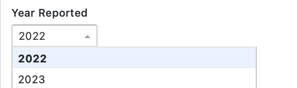
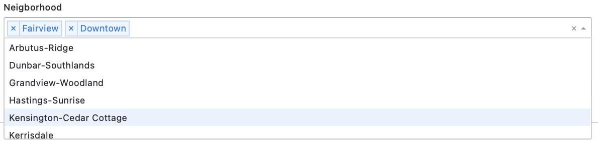
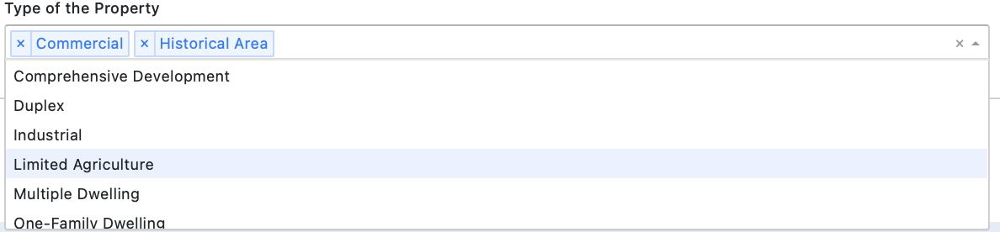
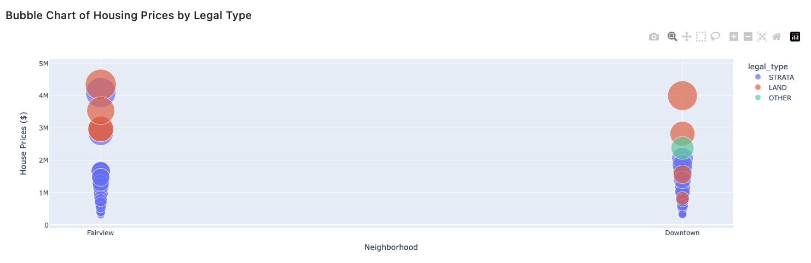
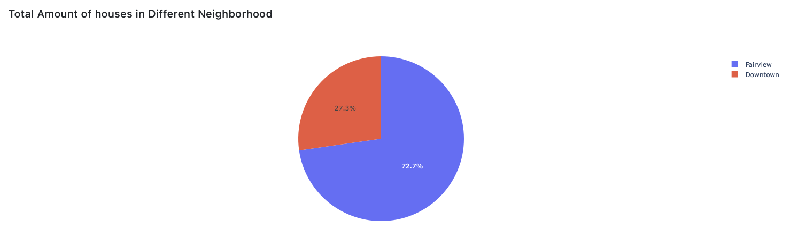

# Vancouver Housing Market Dashboard

## Welcome

Thank you for being interested in  Vancouver Housing Market App!

The app is designed to provide an interactive and informative way to explore the Vancouver housing market. Whether you're a real estate professional, a data analyst, or simply curious about the housing price trends in Vancouver, this app has something for you.

I hope you find my app useful and informative. Happy exploring!

## Motivation and purpose

The housing market in Vancouver has been one of the most active and competitive in North America in recent years, with prices fluctuating dramatically and demand consistently outstripping supply. As a result, real estate professionals, home buyers, sellers, researchers, policymakers, etc. all need access to up-to-date information on housing prices and trends.

The purpose of this app is to provide a user-friendly, interactive, and informative tool for monitoring Vancouver's housing market. The app aggregates data on housing prices from the City of Vancouver Open Data Portal and presents it in an engaging format, allowing users to gain insights into trends and patterns over time.

The motivation for developing this app was to create a comprehensive and informative app that can serve as a valuable resource for anyone interested in understanding Vancouver's housing market. The app is designed to be user-friendly and interactive, with a range of visualizations that help users make sense of the presented information. Ultimately, the goal is to help users stay informed about the state of the market and make better-informed decisions.Visit [Proposal](https://github.com/UBC-MDS/van_houses/blob/main/reports/proposal.md)) for further information.


## How to use this app

The program follows a conventional dashboard layout in which the user can select or specify the scope of what they need to visualize on the left side, and a set of relevant visualization components that update in response to the user's selection criteria on the right.

Here's a link to the live [application](https://vanhouses-dash-n2zj.onrender.com) if you like to check it out.


This dashboard application includes the following selection/filtering mechanisms:

1. Specify the year of interest, in the form of a dropdown menu that allows the user to select the specific year.


2. Specify one or more Vancouver neighbourhood to focus the visulization on.


3. Specify the type of property.



This dashboard has the following visualizations:

1. A histogram plot of housing prices based on the selected filters


2. A bubble chart of the housing prices based on the selected filters. 



3. A pie chart that displays the count of the amount of the houses based on the selected neighborhood.




## Getting started

Before you get started, I recommend you take a look at [Dash](https://dash.plotly.com/) from plotly which was used to scaffold and build this application. 

To setup your development environment to contribute to VanCrime please follow these instructions below:

1.  Clone this [repository](https://github.com/zchen156/vanhouses) and create a development branch

    ``` console
    $ git switch -c name-of-your-contributing-branch
    ```
2.  Install the required Python packages. For your convenience I have included both the requirements.txt and environment.yml files if you prefere to use conda.
    
    ``` console
    $ pip install -r requirements.txt
    ```

3.  Using your favorite IDE (recommending VSCode) got to `app.py` in the root directory and execute it. This step depends on your the type of IDE you have used. In its simplest forms, this step boils down to invoking the python interpreter in an environment that has all the needed dependencies (see step 2.)

    ``` console
    $ python app.py
    ```

Congratulations, you are now able to develop and contribute to the vanhouses dashboard application. 


## Contributing

We welcome anyone who is interested in contributing to my app for Vancouver's housing market. This project is open-source, which means that anyone can view and contribute to the code on this GitHub repository.

If you are interested in getting involved, check out the [contributing guidelines](CONTRIBUTING.md). Please note that this project is released with a [Code of Conduct](CODE_OF_CONDUCT.md). By contributing to this project, you agree to abide by its terms.


## Data Source

The data on housing prices are retrieved from the [City of Vancouver Open Data Portal](https://opendata.vancouver.ca/explore/dataset/property-tax-report/table/?sort=-tax_assessment_year).

## License

Licensed under the terms of the MIT license.
